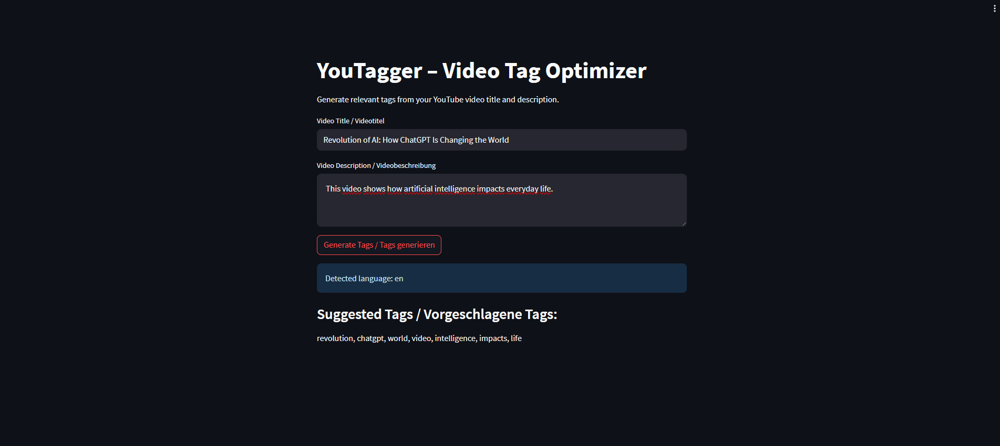

# YouTagger – Video Tag Optimizer

**YouTagger** is a smart and lightweight web app that automatically generates relevant tags for your YouTube videos based on the title and description.  
It automatically detects whether your input is in English or German and applies the appropriate NLP model.

## 🚀 Features

- 🌐 **Automatic language detection** (English 🇬🇧 & German 🇩🇪 & and others)
- 🧠 **NLP-powered keyword extraction** using spaCy
- ⚡ Easy-to-use **Streamlit interface**
- 🏷️ Extracts the **top 10 most frequent nouns and proper nouns**
- 💬 **Bilingual UI** (EN/DE)

## 🛠️ Tech Stack

- [Python 3.8+](https://www.python.org/)
- [spaCy](https://spacy.io/)
- [langdetect](https://pypi.org/project/langdetect/)
- [Streamlit](https://streamlit.io/)

## 📦 Installation

1. Clone the repository  
   ```bash
   git clone https://github.com/your-username/youtagger.git
   cd youtagger
   ```

2. (Optional) Create and activate a virtual environment

```bash
python -m venv venv
source venv/bin/activate  # On Windows: venv\Scripts\activate
```

3. Install dependencies
```bash
pip install -r requirements.txt
python -m spacy download en_core_web_sm
python -m spacy download de_core_news_sm
```

4. Run the app
```bash
streamlit run src/youtagger_app.py
```

## 🖼️ Preview


## 📄 Example Use

**Input:**
```bash
Title: Revolution of AI: How ChatGPT Is Changing the World  
Description: This video shows how artificial intelligence impacts everyday life.
```

**Output:**
```bash
Tags: Revolution, AI, ChatGPT, World, Video, Artificial, Intelligence, Life
```

## 📄 License
[MIT License](./LICENSE) © 2025 Sivanajani Sivakumar